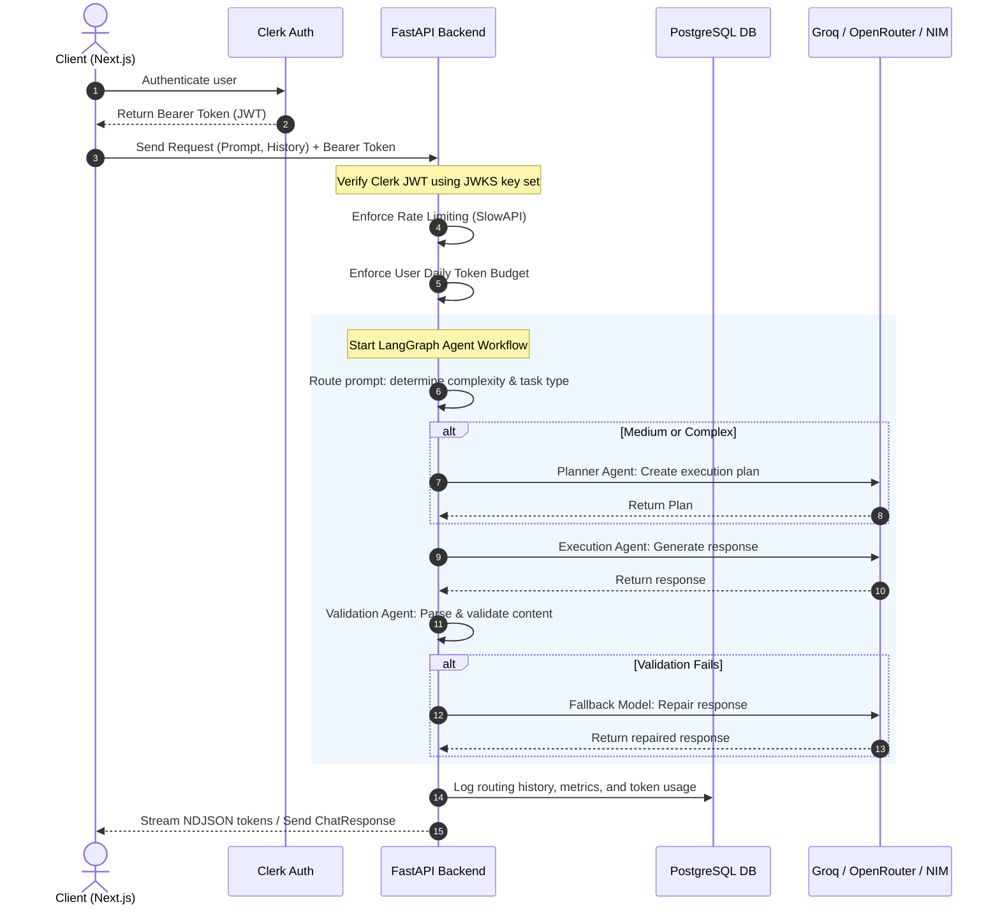
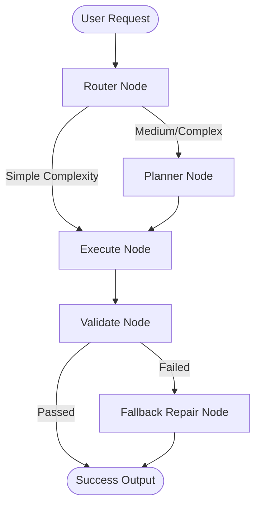

# 🌐 OmniRoute AI

<p align="center">
  
  
  
  
  
</p>

### *Intelligent, Security-First Multi-Model AI Agent Orchestration Platform*

OmniRoute AI is a production-ready, security-first AI SaaS platform designed to dynamically route user prompts across high-performance LLM engines (Groq, OpenRouter, and NVIDIA NIM), coordinate multi-agent LangGraph workflows, perform rigid output validation, enforce daily token budgets, track granular latency/costs, and serve rich performance analytics.

---

## 🚀 Key Features

* **🧠 Dynamic Routing Classifier**: Classifies user queries based on task type (`summarization`, `coding`, `reasoning`, `extraction`, `planning`, `debugging`), complexity (`simple`, `medium`, `complex`), and classifier confidence, matching prompts to the optimal cost-efficient model.
* **⛓️ LangGraph Orchestration**: Executes workflows with dedicated nodes for query planning (`Planner Agent`), specialized execution agents, and a dedicated `Validation Agent` that verifies output formats and safely repairs malformed completions.
* **🛡️ Security-First Architecture**: 
  - Strict server-side isolation for provider API secrets.
  - Verification of JWT tokens using Clerk's JSON Web Key Sets (JWKS).
  - Pydantic validation on prompt payload size, enums, history depth, and characters.
  - Active CSP, HSTS, X-Frame-Options, CORS whitelist rules, and request size limiting.
  - Per-user daily token budgets to prevent excessive usage.
* **⚡ Production-Ready APIs**: High-throughput JSON endpoints with native support for real-time Streaming responses (`stream: true`) using NDJSON delivery.
* **📊 Analytics & Monitoring**: Complete telemetry capturing latency spikes, token consumption, provider utilization, task distribution, and estimated cost savings.
* **🐳 Seamless Containerization**: Unified multi-container Docker deployment for database, API backend, and Next.js frontend interfaces.

---

## 🏗️ System Architecture & Request Cycle

OmniRoute AI coordinates the client request cycle through a secure, high-speed multi-stage pipeline:



---

## ⛓️ LangGraph Agent Flow Detail

The orchestrator leverages LangGraph to coordinate the lifecycle of a prompt. The graph compiles four key nodes:



1. **`router`**: Evaluates prompt parameters:
   - `simple` $\rightarrow$ Routes directly to Groq `llama-3.1-8b-instant`.
   - `medium` $\rightarrow$ Routes to Groq `llama-3.3-70b-versatile` through the `planner`.
   - `complex` $\rightarrow$ Escalates to OpenRouter `deepseek-r1` through the `planner`.
   - `coding/debugging` $\rightarrow$ Routes to OpenRouter `deepseek-coder`.
2. **`planner`**: Active for `medium` and `complex` classification levels, drafting structured blueprints for execution.
3. **`execute`**: Executes the user request, utilizing either coding-specialized system prompts or general system prompts.
4. **`validate`**: Assesses quality, safety, and formats. If checks fail, it engages the configured fallback model (e.g., OpenRouter `gpt-oss-20b` or custom OpenAI endpoint) for self-healing/repair before completion.

---

## 📁 Repository Structure

```
├── frontend/               # Next.js 15, TypeScript, Tailwind CSS, Clerk Auth
├── backend/                # FastAPI, LangGraph, SQLAlchemy (Async ORM), Pydantic
├── database/               # PostgreSQL relational schema definition
├── docker-compose.yml      # Local multi-service orchestration (DB + API + Web)
└── railway.json            # Auto-deployment backend script for Railway
```

---

## 🔌 API Reference Catalog

### 1. `POST /chat`
Executes the main AI orchestrator workflow. Supports standard responses or streaming token delivery.

**Headers:**
```http
Authorization: Bearer <clerk_jwt_token>
Content-Type: application/json
```

**Request Payload:**
```json
{
  "prompt": "Optimize this SQL query: SELECT * FROM users WHERE active = true;",
  "conversation_id": "a6acfe06-75fb-49b1-9f70-adced37b8b3b",
  "history": [
    { "role": "user", "content": "Hello!" },
    { "role": "assistant", "content": "Hello! How can I assist you today?" }
  ],
  "stream": false
}
```

**Response Payload:**
```json
{
  "conversation_id": "a6acfe06-75fb-49b1-9f70-adced37b8b3b",
  "response": "Here is the optimized SQL query using proper indexing...",
  "model_used": "deepseek/deepseek-coder",
  "latency_ms": 1150,
  "usage": {
    "prompt_tokens": 124,
    "completion_tokens": 256,
    "total_tokens": 380
  },
  "classification": {
    "task_type": "coding",
    "complexity": "complex",
    "confidence": 0.98
  },
  "validation": {
    "passed": true,
    "risk_level": "low",
    "issues": []
  },
  "workflow_trace": [
    { "agent": "Router Agent", "status": "completed", "detail": "Selected coding model" },
    { "agent": "Coding Agent", "status": "completed", "detail": "Generated response" },
    { "agent": "Validation Agent", "status": "completed", "detail": "Passed validation checks" }
  ],
  "estimated_cost": 0.00038
}
```

---

### 2. `POST /route`
Simulate prompt routing without generating answers. Useful for system monitoring.

**Request Payload:**
```json
{
  "prompt": "Explain Quantum Computing in 3 sentences."
}
```

**Response Payload:**
```json
{
  "classification": {
    "task_type": "reasoning",
    "complexity": "medium",
    "confidence": 0.91
  },
  "selected_model": "llama-3.3-70b-versatile",
  "provider": "groq",
  "fallback_model": "openai/gpt-oss-20b",
  "fallback_provider": "openrouter",
  "reason": "Medium complexity work was routed to the balanced model."
}
```

---

### 3. `GET /analytics`
Retrieves usage history, performance metrics, and cost savings.

**Response Payload:**
```json
{
  "total_requests": 2540,
  "total_tokens": 1845920,
  "average_latency_ms": 780.5,
  "estimated_cost": 1.45,
  "estimated_cost_savings": 14.80,
  "routing_distribution": {
    "groq": 1820,
    "openrouter": 720
  },
  "model_utilization": {
    "llama-3.1-8b-instant": 1200,
    "llama-3.3-70b-versatile": 620,
    "deepseek/deepseek-coder": 500,
    "deepseek/deepseek-r1": 220
  },
  "task_type_distribution": {
    "summarization": 300,
    "coding": 500,
    "reasoning": 740,
    "extraction": 200,
    "planning": 150,
    "debugging": 650
  },
  "recent_activity": []
}
```

---

### 4. `GET /models`
Lists all supported models, availability statuses, and context windows.

**Response Payload:**
```json
[
  {
    "name": "llama-3.1-8b-instant",
    "role": "simple",
    "provider": "groq",
    "available": true,
    "context_window": 8192
  },
  {
    "name": "deepseek/deepseek-coder",
    "role": "coding",
    "provider": "openrouter",
    "available": true,
    "context_window": 16384
  }
]
```

---

## ⚙️ Environment Configuration Playbook

Duplicate configuration templates before setting up:
```powershell
copy .env.example .env
copy backend\.env.example backend\.env
copy frontend\.env.example frontend\.env.local
```

### Backend Provider Settings
| Variable Name | Required | Provider Scope | Description |
|---|---|---|---|
| `GROQ_API_KEY` | Optional | Groq | Access key for Groq API models. |
| `OPENROUTER_API_KEY` | Optional | OpenRouter | Access key for OpenRouter models. |
| `NVIDIA_NIM_API_KEY` | Optional | NVIDIA NIM | Access key for self-hosted/cloud NVIDIA NIM models. |
| `NVIDIA_NIM_BASE_URL` | Optional | NVIDIA NIM | Overrides default NIM endpoint gateway. |

### Dynamic Model Route Settings
| Variable | Default Value | Role Target |
|---|---|---|
| `SIMPLE_PROVIDER` | `groq` | Provider for light tasks |
| `SIMPLE_MODEL` | `llama-3.1-8b-instant` | Model for light tasks |
| `BALANCED_PROVIDER` | `groq` | Provider for medium tasks |
| `BALANCED_MODEL` | `llama-3.3-70b-versatile` | Model for medium tasks |
| `CODING_PROVIDER` | `openrouter` | Provider for code tasks |
| `CODING_MODEL` | `deepseek/deepseek-coder` | Model for code tasks |
| `REASONING_PROVIDER` | `openrouter` | Provider for deep thinking |
| `REASONING_MODEL` | `deepseek/deepseek-r1` | Model for deep thinking |
| `FALLBACK_PROVIDER` | `openrouter` | Provider for response healing |
| `FALLBACK_MODEL` | `openai/gpt-oss-20b` | Model for response healing |

---

## 💻 Local Development Playbook

### 1. Prerequisites Setup
Ensure Docker, Python 3.10+, and Node.js 18+ are configured locally.

### 2. Startup Backend
Activate python environment, install dependencies, and launch FastAPI server:
```powershell
cd backend
python -m venv .venv
.venv\Scripts\activate
pip install -r requirements.txt
uvicorn app.main:app --reload
```
Open API Swagger docs at `http://localhost:8000/docs`.

### 3. Startup Frontend
Install Node packages and run the Next.js developer hot-reload pipeline:
```powershell
cd frontend
npm install
npm run dev
```
Open Web Dashboard at `http://localhost:3000`.

### 4. Running Multi-Containers via Docker
Run single-command local virtualization orchestrator:
```powershell
docker compose up --build
```

---

## 🧪 Verification & Production Guidelines

### Execute Tests
Execute test suites to verify backend security and routing engines:
```powershell
cd backend
.venv\Scripts\python.exe -m pytest
```

Ensure frontend builds flawlessly without warnings or audit security blocks:
```powershell
cd ../frontend
npm run build
npm audit --audit-level=high
```

### Production Guidelines
* **Database Migrations**: Avoid running inline `Base.metadata.create_all` in production lifespans. Utilize `Alembic` database migrations to update production tables safely.
* **Distributed Rate Limiting**: Shift FastAPI rate-limiting SlowAPI storage to Redis engines to handle load across multi-instance node deployments.
* **Enhanced Safety Policies**: Add tenant isolation policies to your database and restrict origin headers to trusted domains.
* **Model Failovers**: Setup provider key rotations and ensure multiple backup fallback routes are configured inside `.env`.
